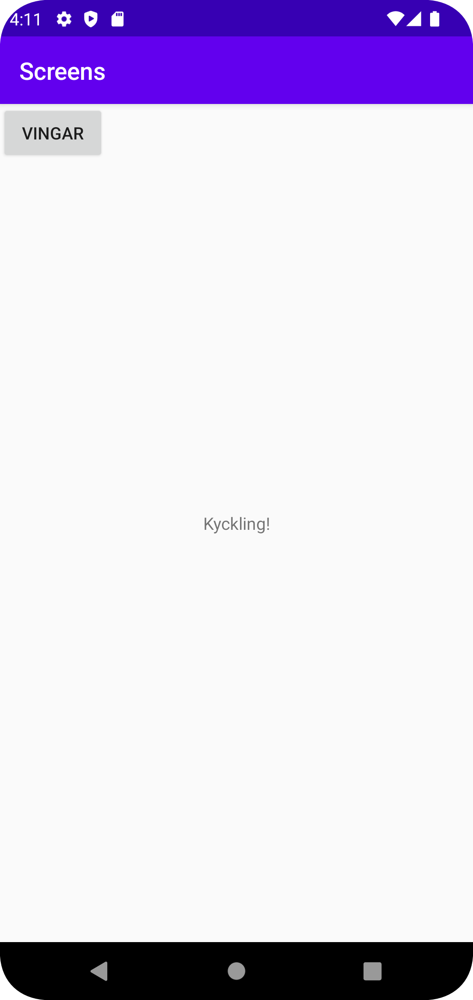
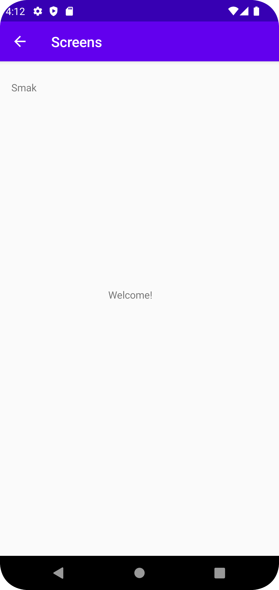

# Rapport

**Först skapades en second activity(SecondActivity) detta är vart datan skickas till. Sedan skapades en knapp som skall ta oss från MainActivity till SecondActivity. Därefter lades till data inom intent bundle genom att använda mig av extras, där en intent har skapats för att visa vart datan kommer ifrån och går till. Under den så har jag skapat namnet smak som skall skickas till secondActivity när en trycker på min button. Dessutom så har det skapats en tillbaka knapp genom att lägga till (android:parentActivityName = ".MainActivity"). Nedan finns kod snuttar på Main och Secondary sidan som visar hur datan skickas från en sida till en annan samt hur den datan visas på den mottagande sidan.**

```
//MainActivity
 but.setOnClickListener(new View.OnClickListener() {
            @Override
            public void onClick(View view) {
                Log.d("==>", "We clicked on Kyckling!");
                Intent intent = new Intent(MainActivity.this, SecondActivity.class);
                intent.putExtra("name", "Smak"); // Optional
                startActivity(intent);
            }

        });

//SecondACtivity
  Bundle extras = getIntent().getExtras();
        if (extras != null) {
            String name = extras.getString("name");
            // Do something with the name and number

            TextView details = findViewById(R.id.details);
            details.setText(name);

        }
```

Bilder läggs i samma mapp som markdown-filen.

, 

Läs gärna:

- Boulos, M.N.K., Warren, J., Gong, J. & Yue, P. (2010) Web GIS in practice VIII: HTML5 and the canvas element for interactive online mapping. International journal of health geographics 9, 14. Shin, Y. &
- Wunsche, B.C. (2013) A smartphone-based golf simulation exercise game for supporting arthritis patients. 2013 28th International Conference of Image and Vision Computing New Zealand (IVCNZ), IEEE, pp. 459–464.
- Wohlin, C., Runeson, P., Höst, M., Ohlsson, M.C., Regnell, B., Wesslén, A. (2012) Experimentation in Software Engineering, Berlin, Heidelberg: Springer Berlin Heidelberg.
